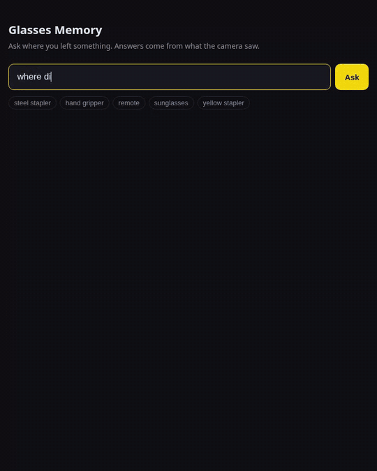

# glasses-memory

"Where did I leave my keys?" for first-person (smart-glasses style) video.

Register an object once, follow it through the video, remember where it was put down.

Built jointly by Sujan Sekar and Abhinav Pallath.



## Try it yourself
Needs an NVIDIA GPU (4 GB is enough) and Python 3.11.

```bash
git clone https://github.com/metro-dev26/glasses-memory && cd glasses-memory
python -m venv venv && source venv/bin/activate
pip install torch torchvision --index-url https://download.pytorch.org/whl/cu121
pip install -r requirements.txt
./setup.sh                                  # downloads the SAM 2.1 checkpoints
python run.py path/to/your_video.mp4
```

1. Record a walk around your room: show each object up close first, then move things.
2. `run.py` opens a window. Press `d` / `a` to scrub to an object's close-up, `space` to drag a box
   around it, then type its name in the terminal. Repeat for each object, `q` to save.
3. Wait for tracking: about 5 min per 1 min of video on an RTX 3050 (`python run.py video.mp4 tiny` is faster, less accurate).
4. Your browser opens the ask page: "where's my remote?".

Everything stays on your machine. The readable memory is in `memory/MEMORY.md`.

## Run the live version on your own laptop
The newer engine (`engine/`) and the live dashboard (`server/`, `dashboard/`). An NVIDIA GPU
is optional: without one it runs on the CPU, at about 4 processed frames a second instead of 8+.
Needs Python 3.11 and Node 20+.

```bash
git clone https://github.com/metro-dev26/glasses-memory && cd glasses-memory
python -m venv venv
source venv/bin/activate        # Windows: venv\Scripts\activate
# PyTorch first. NVIDIA GPU:
pip install torch torchvision --index-url https://download.pytorch.org/whl/cu121
# ...or CPU only:
pip install torch torchvision --index-url https://download.pytorch.org/whl/cpu
pip install -r requirements-live.txt     # no SAM 2 / CLIP: those are only for run.py
cd dashboard && npm install && npm run build && cd ..
```

The model weights (YOLOE, DINOv3, the text model) download themselves on first run.

Put a video in `videos/` (personal footage is git-ignored), then either:

```bash
python -m engine.run videos/x.mp4 --store store/x --fresh   # prints what it remembers
python -m server.app --video videos/x.mp4 --loop            # dashboard at http://localhost:8000
python -m pytest -q                                         # 29 tests
```

Test videos with a written-down answer key are described in [docs/demo/](docs/demo/).
More on the server (phone camera, Tailscale, latency): [server/README.md](server/README.md).

## How it works
1. **Register** (`register.py`): drag one box per object on a close-up frame.
2. **Track** (`track.py`): one SAM 2 pass follows every object together, at 10 fps.
3. **Sleep** (`remember.py`): turn per-frame tracks into episodes. Drop glitches (<0.3 s)
   and episodes that don't look like the registered object (CLIP similarity < 0.70).
4. **Remember**: write `memory/MEMORY.md` plus one markdown card per object with snapshots.
   Answers are "last known, not current".

## Results on test video 3 (5 moved objects, ground truth from the recorder)
| Approach | Correct | Partial | Wrong |
|---|---|---|---|
| YOLO-World + CLIP filter (`experiments/memory.py`) | 0 | 2 | 3 |
| SAM 2 tiny, one object at a time | 3 | 1 | 1 |
| SAM 2 tiny, all objects in one pass (6x faster) | 3 | 1 | 1 |
| SAM 2 base+, one pass, + look-alike check | 4 | 1 | 0 |

Partial = the pen: tracked while being moved, lost before it was set down.

## Validation: video 4 (new objects, nothing tuned on it)
| Object | Truth | Memory says | |
|---|---|---|---|
| Remote | moved to the bed | on the bed, 38.0s | ✅ |
| Hand gripper | moved to the side table | on the side table, 47.1s | ✅ |
| Yellow stapler | out of the cupboard, onto the table | on the table, 59.8s | ✅ |
| Steel stapler | (recorder forgot; footage shows the desk by the laptop, ~30s) | episode ends 30.6s, snapshot still in hand at 28.1s | 🟡 |
| Sunglasses | left → right on the notebook (~24s) | a false episode in the cupboard at 54s (look-alike 0.74 > 0.70) | ❌ |

**3 / 5 correct, 1 partial, 1 wrong.** Lower than video 3 (4/5), as expected for an
untuned video. The weak link is the look-alike check: CLIP knows "kind of thing",
not "this exact thing". Next: an instance-level embedding (e.g. DINOv2) or several
crops per episode, validated on a 5th video.

Fixes found on video 4 (design fixes, not threshold tuning):
- snapshot = the last clear frame of an episode (where it was left), not the biggest
- ignore tracks before an object is registered (SAM 2 guesses before its prompt)

New here? Read [docs/HANDBOOK.md](docs/HANDBOOK.md): every file, every design choice, and the rules.

Earlier experiments (YOLO-World, OWLv2, SAM 2 one object at a time) live in [`experiments/`](experiments/).
